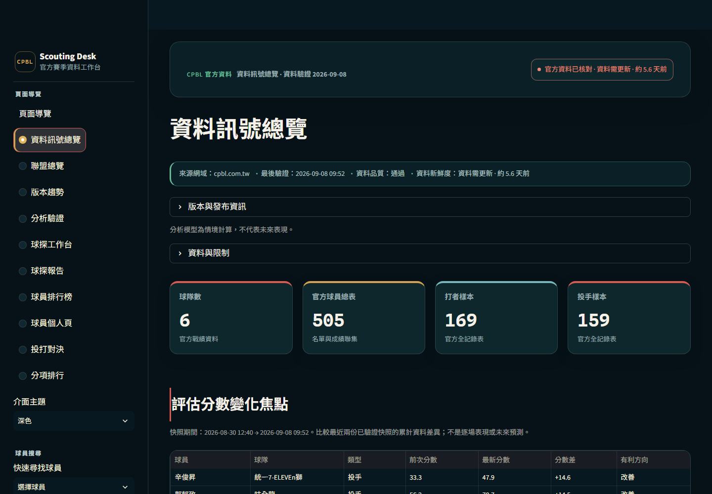
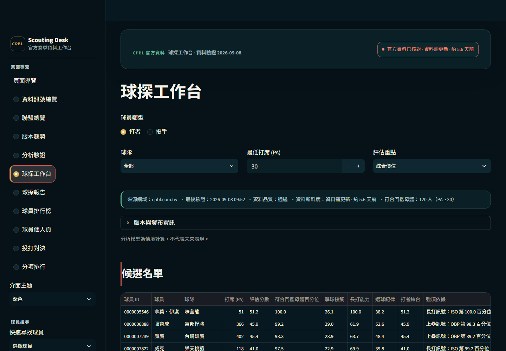
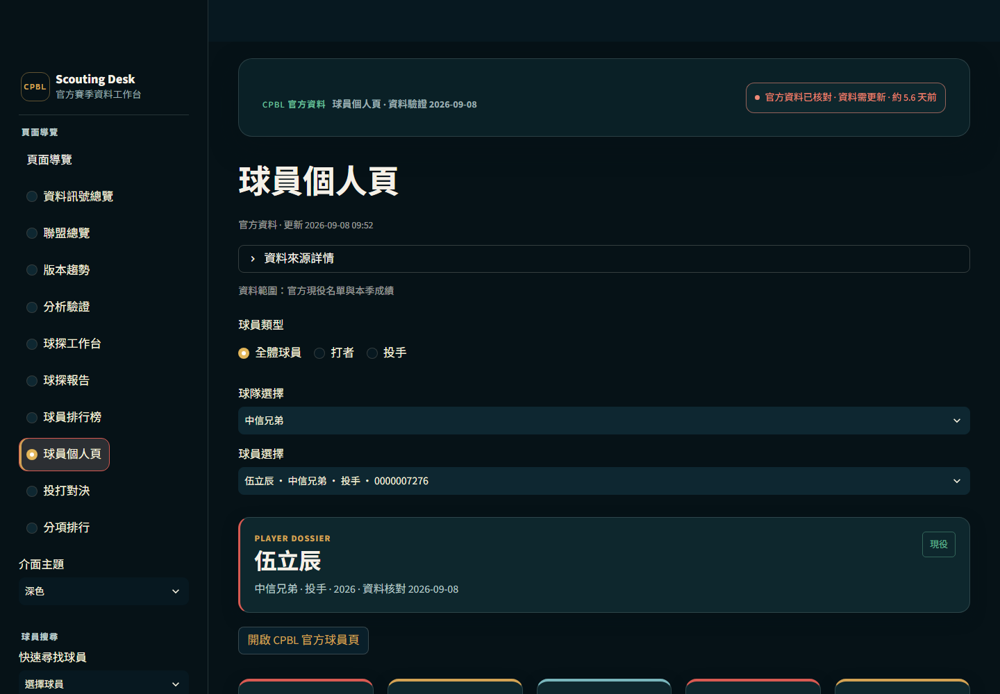

# CPBL 中職資料分析平台

以官方 CPBL 資料來源建立的可追溯資料產品，涵蓋資料管線、資料品質與可稽核性、球員評估、球探工作台、球探報告、版本差異與響應式 Streamlit UI。

這是獨立分析作品，為非 CPBL 官方服務。不預測比賽或產生名單建議，也不對傷勢、戰術、未來表現或球員名單決策作出結論。

## 介面預覽

## 核心能力

- 只從 CPBL 官方公開頁面取得資料，限制來源主機並驗證分頁完整性。
- 以 player_id 作為跨資料表業務主鍵，避免同名誤選與前導零遺失。
- schema、重複 ID、數值範圍、最低涵蓋量與快照血緣檢查失敗時阻止發布。
- 球探工作台支援打者／投手、PA／IP 門檻、球隊篩選與最多四人比較。
- 觀察名單可產生球探報告、下載球探報告 Markdown、下載 CSV 與下載稽核 Manifest JSON。
- 版本趨勢、累計資料差異、分析驗證與報告 report_id 可重建。
- 所有公開產物由 public_release_manifest.json 綁定 SHA-256、大小與結構。

## 實際使用流程

1. 先在資料訊號總覽確認來源、日期、品質與限制。
2. 在球探工作台設定資格條件，建立觀察名單。
3. 在球員個人頁閱讀官方事實資料、百分位、強項與風險。
4. 用版本趨勢與分析驗證檢查資料刷新及排序穩定性。
5. 下載球探報告或稽核 Manifest，離線驗證 report_id 與快照血緣。

報告查詢條件包含 report_type、report_team、report_threshold、report_focus 與 watchlist。報告可重建但仍不是逐場表現或未來預測。

## 評估公式

打者與投手先套用資格門檻：打者 PA >= 30，投手 IP >= 10。評估只使用固定的描述性指標與聯盟母體百分位：

~~~text
player_value_score = 0.70 * power_score + 0.30 * hitter_value_score
contact_score = 0.55 * contact_score + 0.45 * discipline_score
pitcher_value_score = 0.75 * run_prevention_score + 0.25 * pitcher_value_score
command_score = 0.70 * command_score + 0.30 * strikeout_score
~~~

實際頁面會同時顯示資料量、母體、強項、風險與限制，避免把 player_value_score 解讀成未來表現預測。LOG5 為情境計算，非校準預測模型。

## 官方 CPBL 資料來源

- https://cpbl.com.tw/player
- https://cpbl.com.tw/standings/season
- https://cpbl.com.tw/stats/recordall
- https://cpbl.com.tw/stats/recordallaction

資料管線只接受 cpbl.com.tw 官方來源；連線、解析、分頁或品質檢查失敗時停止，不以 Mock Data 掩蓋錯誤。

## 重現與測試

~~~powershell
.\run_project.bat --check
.\run_project.bat --offline-check
.\run_project.bat --runtime-check
python run_all.py --mode api
python -m pytest -q
python -m src.verify_public_release reports/metrics/public_release_manifest.json
~~~

CI 同時驗證 security.yml、data-health.yml、/_stcore/health、browser UI、資料品質與公開發布契約。release_health.json 會檢查相鄰快照與發布健康；public_release_manifest.json 是公開發布 Manifest，會檢查 release_id、SHA-256、列數及欄位。player_movements.csv 保存球員版本移動與累計資料差異，不是逐場表現或未來預測。

## 公開儲存庫政策

### 可公開追蹤

程式碼、測試、處理後且可驗證的展示資料、quality gate、必要文件、docs/screenshots/ 與安全政策。

### 永不追蹤

data/raw/、data/processed/（若非發布所需的衍生資料）、notes/、.env、.streamlit/secrets.toml、本機路徑、API 憑證、cache、測試暫存與個人資料。

公開資料需經過 data quality、release health 與 public release manifest 驗證；reports/metrics/data_quality_report.json、release_health.json、public_release_manifest.json 只保留可重現發布所需的摘要。

## 授權與資料來源聲明

本儲存庫目前未指定開源授權；除非另有書面同意，程式碼與文件不授予再發布或商業使用權。CPBL 名稱、球隊／球員識別資訊、統計資料與官方網站內容之權利歸屬原權利人；使用處理後資料時，請遵守來源網站的使用規範與適用條款。本專案僅作資料工程與分析展示，不代表 CPBL 官方服務或立場。

## 資料限制

來源頁面格式可能變動，官方資料也可能有缺欄位、延遲與快照差異。分析不預測比賽或產生名單建議，不代表 CPBL 官方立場，也不能推論傷勢、戰術、未來表現或球員名單決策。

## 部署與營運

本機與 Streamlit 部署都應使用已驗證的入口與環境 secrets。部署後以 /_stcore/health 檢查服務，再執行 browser UI 與下載驗證。完整操作及 release checklist 見 [docs/DEPLOYMENT.md](docs/DEPLOYMENT.md)、[docs/RELEASE_CHECKLIST.md](docs/RELEASE_CHECKLIST.md)、[docs/REVIEW_GUIDE.md](docs/REVIEW_GUIDE.md)。
