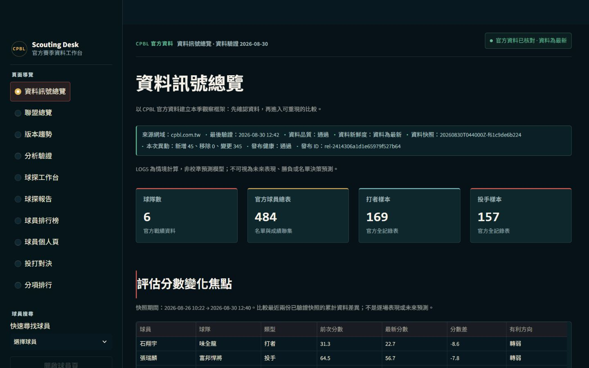
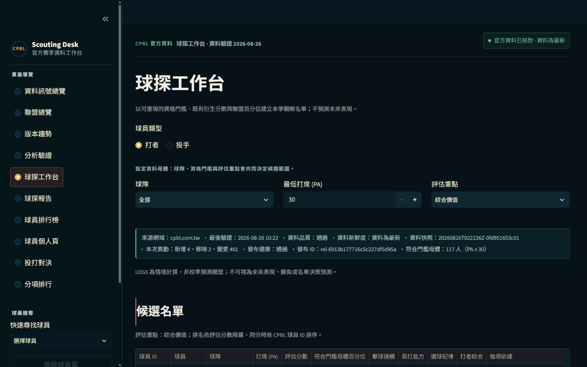
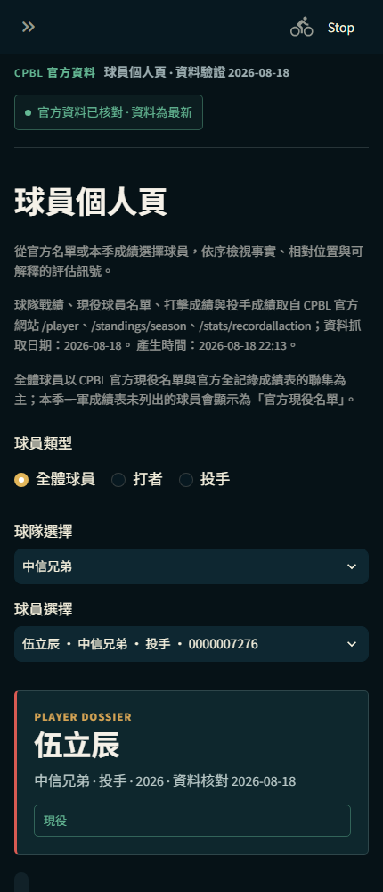

# CPBL 中職資料分析平台

> **Data product / Data engineering / Analytics engineering / Streamlit**

一個以 CPBL 官方公開資料為唯一資料來源，具備資料品質閘門、可稽核快照、球員評估、版本差異分析與響應式 Streamlit 介面的資料產品。

> 本專案是獨立資料分析作品，非 CPBL 官方服務。不預測比賽或產生名單建議；分析結果不構成投注、比賽結果、球員評價或名單決策建議。

## 面試官 60 秒導讀

這個專案值得看的地方，不是把幾張圖表放進 Streamlit，而是把「官方資料如何變成可信的分析產品」完整做出來：

1. **資料來源可追溯**：只從 CPBL 官方公開頁面取得資料，限制來源主機、驗證 HTTP 與分頁完整性，並保留資料來源與處理時間。
2. **品質失敗會阻止發布**：schema、業務主鍵、重複球員、數值範圍與最低涵蓋量都在前端前檢查；品質狀態為 failed 時不建立快照，也不啟動分析流程。
3. **每次刷新都有血緣**：處理後資料以內容指紋建立快照，保存 SHA-256、版本時間、前一版本與異動摘要，支援回答「這次刷新改變了什麼」。
4. **分析結果可解釋**：資格門檻、聯盟母體百分位、固定評估分數、強項／風險訊號與 LOG5 限制都直接呈現在產品介面。
5. **產品流程是真實可操作**：完整球員搜尋、深連結、篩選、比較、版本切換、空資料狀態、CSV 下載、響應式版面與可及性細節都有測試。
6. **分析交付可以被獨立驗證**：球探報告會輸出含方法版本的 Manifest，使用者不需要相信畫面當下的結果，可以在本機重新計算 `report_id` 檢查檔案是否被修改。

這是一個可重跑的資料產品，而不是依賴 Sample Data、Mock Data 或一次性手動整理的展示頁。

審查者可直接依照 [Review Guide](docs/REVIEW_GUIDE.md) 重現資料流程、品質閘門與發布驗收。

## 最新驗證摘要

以下數字來自本次以 CPBL 官方資料執行 run_project.bat --check 後的本地驗證。資料檔案更新時，README 的數字應與 reports/metrics/data_quality_report.json 一起重新檢查。

| 項目 | 最新結果 |
| --- | --- |
| 資料來源 | CPBL 官方公開頁面擷取；mode=api 為相容的流程參數 |
| 最後驗證時間 | 2026-08-19 19:25（Asia/Taipei） |
| 品質狀態 | pass |
| 官方現役名單 | 457 人 |
| 打者／投手成績聯集 | 458 位球員 |
| 已驗證資料快照 | 8 份 |
| 最新資料快照 | `20260819T084104Z-e3f9f1e437fa` |
| 球員版本變化紀錄 | 2,106 筆 |
| 完整測試 | 147 passed |
| Smoke test | passed |

## 實際使用畫面

以下截圖是在本機啟動真實 Streamlit 應用程式後，使用最新處理資料擷取的畫面，不是設計稿或生成圖片。畫面中的資料、頁面名稱與指標均來自目前版本的 app.py 與 data/processed/。

### 資料訊號總覽

先確認資料來源、品質、新鮮度、涵蓋範圍與分析限制，再進入球探或比較流程。這是產品的第一個決策閘門。

### 球探工作台

使用者可切換打者／投手、調整 PA／IP 資格門檻、選擇評估重點、篩選球隊並比較最多四位球員。百分位母體會先固定，再套用使用者的畫面篩選。

### 球員個人頁（行動版）

球員頁把官方身份、當季成績、進階指標、聯盟平均、百分位、能力雷達圖、相似球員與前次快照變化集中在同一個可追溯檔案中。

## 三分鐘操作流程

1. 啟動 run_project.bat，程式會先準備 .venv、刷新官方資料、執行品質閘門與測試，再啟動本機網站。
2. 在左側「快速尋找球員」輸入或選擇完整球員選項。選項包含姓名、球隊、守位／角色、官方名單狀態與 CPBL player_id，避免同名誤選。
3. 先看「資料訊號總覽」的品質狀態、資料日期與限制，再進入「球探工作台」建立候選範圍。
4. 點開「球員個人頁」查看事實資料與評估依據；如果資料沒有達到 PA／IP 門檻，頁面會標示樣本不足，而不是產生看似精準的排名。
5. 使用「版本趨勢」比較兩個時間順序有效的官方快照，閱讀新增、移除、變更與未變更球員。
6. 使用頁面上的「下載 CSV」保存目前畫面展示的欄位；下載內容使用繁體中文欄名與 UTF-8 BOM，方便在 Excel 開啟。

球員頁也支援深連結：

~~~text
/?page=球員個人頁&player=<CPBL player_id>
~~~

重新整理或分享網址後，應仍回到相同的球員檔案。

## 產品定位與核心價值

### 解決的問題

CPBL 公開資料分散在不同頁面，原始表格格式可能變動，同一球員也可能同時出現在現役名單、打擊成績與投手成績中。若只在前端直接讀取或手動整理，容易出現來源不可追溯、同名球員選錯、前導零遺失、統計母體不一致，以及資料更新後無法說明差異等問題。

本平台用資料產品的方式處理這些風險：

- 只從 CPBL 官方主機取得資料，不以 Sample Data、Mock Data 或前端硬編碼資料取代正式來源。
- 以 player_id 作為跨資料表的業務主鍵，並全程以字串保存，避免前導零遺失。
- 在資料進入前端前執行 schema、分頁完整性、重複 ID、欄位型別與數值範圍檢查。
- 品質檢查通過後建立處理後快照，保存 SHA-256 指紋與相鄰版本差異。
- 把評估分數、百分位、優勢與風險拆成可解釋的分析訊號。
- 公開儲存庫只包含可部署的處理後資料與程式碼，不公開原始 HTML、本機路徑、環境憑證或內部暫存資料。

### 工程能力展示

- Data ingestion：官方網站資料擷取、分頁完整性與來源主機限制。
- Data quality：資料綱要、業務主鍵、重複資料、數值合理性與品質閘門。
- Data engineering：可重現的 ETL 流程、資料快照、manifest 與衍生資料表。
- Analytics engineering：資格門檻、聯盟基準、百分位、球員評估與 LOG5 情境模型。
- Product engineering：搜尋、篩選、比較、下載、Loading、Error 與 Empty state。
- Software engineering：模組化 Python 架構、測試、文件、CI、安全掃描與部署規範。

## 功能總覽

### 資料訊號總覽

顯示目前資料版本的來源狀態、資料新鮮度、品質檢查、涵蓋球隊／球員數量與分析限制，讓使用者先判斷資料是否適合解讀，再閱讀分析結果。

### 聯盟總覽

呈現 CPBL 官方球隊戰績、勝差與近況，保留資料時間與來源資訊。戰績欄位來自處理後的官方資料，前端不重新推算另一份可能不一致的版本。

### 球探工作台

依固定規則產生球員評估與短名單，支援：

- 打者／投手分流。
- 最低打席 PA 與最低投球局數 IP 門檻。
- 球隊、守備位置與投手角色篩選。
- 最多選擇 4 位球員比較。
- 優勢、風險、百分位與評估依據說明。

百分位先在符合球員類型與資格門檻的聯盟母體計算，再套用使用者篩選，避免小範圍篩選被誤當成聯盟基準。

### 觀察名單與球探報告

球探報告把球探工作台的候選結果轉成可重建的工作成果，而不是只停留在當次畫面：

- 先選擇打者／投手、PA／IP 資格門檻、評估重點與球隊，再從符合條件的官方候選人建立觀察名單。
- 最多選擇 4 位球員，報告保留使用者的選取順序，並列出球員 ID、球隊、位置／角色、資格量、評估分數、母體百分位、優勢、風險與資料註記。
- 報告明確寫入品質狀態、資料產生時間、資料快照 ID、資格門檻與評估重點，讓下載檔案離開網頁後仍然可追溯。
- 「建立可分享連結」會把 `report_type`、`report_team`、`report_threshold`、`report_focus` 與 `watchlist` 寫入網址參數；重新整理或分享網址時，系統會從目前已驗證資料版本重新產生報告。
- 提供「下載球探報告 Markdown」與「下載球探報告 CSV」兩個實際操作；下載內容不包含 API 金鑰、登入資訊或本機路徑，報告也不會偷偷寫入本機資料庫。
- 另提供「下載稽核 Manifest JSON」，包含穩定 `report_id`、資料快照、品質狀態、查詢條件、選取球員、分析方法與限制；同一資料版本與條件重建時，`report_id` 不受產生時間影響。
- Manifest schema `1.1` 會把評估方法識別、資料血緣、查詢條件與球員內容納入完整性指紋；舊版 schema `1.0` 仍可驗證。
- 下載檔案後，可在專案根目錄執行以下命令；成功時輸出 `valid: true`、報告 ID、快照 ID 與球員數量，任何內容被修改都會以非零退出碼失敗：

~~~powershell
python -m src.verify_report_manifest .\cpbl_scouting_report_hitter_<snapshot>.manifest.json
~~~

範例深連結格式：

~~~text
/?page=球探報告&report_type=打者&report_team=全部&report_threshold=30&report_focus=綜合價值&watchlist=<CPBL player_id>,<CPBL player_id>
~~~

這個流程適合在面試展示「從資料品質、分析規則到可交付分析成果」的完整鏈路；它仍然不是逐場對戰資料，也不是未來表現預測。
### 球員排行榜

依打者／投手與指標切換排行榜，支援官方累積統計與進階指標閱讀。球員選項以「姓名、球隊、守位、CPBL ID」呈現，避免同名球員或不同資料表紀錄被誤選。

### 球員個人頁

以單一球員為中心整合：

- 官方基本資訊與現役狀態。
- 本季成績與進階指標。
- 聯盟平均比較與百分位。
- 評估依據、強項、風險與資料註記。
- 能力雷達圖與相似球員推薦。
- 與前一份官方快照的累計資料差異。
- 可下載的 UTF-8 CSV。

球員網址可帶入 player=<CPBL player_id>，重新整理後仍能開啟同一位球員。

### 投打對決

使用本季官方彙總成績建立受限的 LOG5 情境，協助比較打者與投手的能力訊號。這不是逐打席對戰資料，也不是校準後的比賽預測模型。

### 版本趨勢

使用通過品質檢查的資料快照，提供：

- 資料版本血緣與每次刷新異動量。
- 球員指標跨版本走勢。
- 時間順序有效版本的新增、移除、變動與未變動比較。
- 版本 ID、捕捉時間、schema 漂移與 SHA-256 指紋摘要。

使用者因此可以回答「這次資料刷新改變了什麼」，而不只是看到最新的一份 CSV。

## 官方 CPBL 資料來源

- [現役球員名單](https://cpbl.com.tw/player)
- [球隊戰績](https://cpbl.com.tw/standings/season)
- [打者與投手全記錄入口](https://cpbl.com.tw/stats/recordall)
- 分頁請求端點（官方表單）：https://cpbl.com.tw/stats/recordallaction

資料流程只接受 cpbl.com.tw 官方來源。來源無法連線、解析失敗、分頁不完整或資料品質檢查失敗時，流程會停止，不會用展示資料掩蓋錯誤。

reports/metrics/data_quality_report.json 會記錄抓取模式、驗證時間、資料列數、涵蓋球隊／球員數、欄位檢查、重複 ID、數值範圍、快照與衍生資料結果。

## 系統架構

~~~text
CPBL 官方公開頁面
        |
        v
src/fetch_cpbl_data.py       取得官方頁面、處理分頁、限制來源主機
        |
        v
src/preprocess.py            清理欄位、統一型別、建立處理後資料
        |
        v
src/data_quality.py          schema、主鍵、重複資料、數值範圍與品質閘門
        |
        +--> data/processed/*.csv
        |
        +--> src/snapshots.py
        |        本機稽核快照、manifest、SHA-256、相鄰版本 diff
        |
        +--> src/movements.py
        |        player_movements.csv：球員累計指標變化
        |
        +--> src/history.py
                 snapshot_history.csv
                 player_metric_history.csv
        |
        v
src/features.py / src/scouting.py / src/rankings.py / src/log5_matchup.py
        |
        v
app.py + src/theme.py + src/app_helpers.py
        |
        v
Streamlit 互動分析介面
~~~

### 目錄說明

| 路徑 | 職責 |
| --- | --- |
| app.py | Streamlit 入口、頁面路由、互動狀態與畫面組合 |
| src/fetch_cpbl_data.py | 官方資料擷取、來源與分頁驗證 |
| src/source_contract.py | 集中管理官方來源路徑、來源描述與相容流程說明 |
| src/preprocess.py | 原始回應轉換為穩定的處理後 CSV |
| src/data_quality.py | 資料品質報告與失敗閘門 |
| src/snapshots.py | 已驗證資料快照、manifest、內容指紋與版本 diff |
| src/movements.py | 相鄰快照的球員指標變化 |
| src/history.py | 版本趨勢與時間旅行用衍生資料 |
| src/features.py | 打者／投手進階指標與可解釋特徵 |
| src/scouting.py | 資格門檻、百分位、評估分數與說明訊號 |
| src/scouting_report.py | 球探報告、Manifest 產生、canonical report_id 與分析交付格式 |
| src/verify_report_manifest.py | 不依賴 Streamlit 的 Manifest schema、內容指紋與檔案完整性驗證 CLI |
| src/rankings.py | 排行榜資料與指標排序 |
| src/log5_matchup.py | LOG5 情境計算 |
| src/app_helpers.py | 前端唯讀資料載入、缺檔與損毀檔防護、球員選項與共用輔助邏輯 |
| src/theme.py | Streamlit 共用樣式、響應式版面與可讀性設計 |
| data/processed/ | 可供前端與部署使用的處理後資料 |
| reports/metrics/ | 品質報告與可審查的資料指標 |
| tests/ | 資料、分析、頁面、啟動器與安全規則測試 |
| docs/ | 部署、營運、設計與工程決策文件 |

## 資料管線與資料契約

執行 python run_all.py --mode api 時，流程依序完成（api 是保留的 CLI 相容名稱，實際為官方公開頁面擷取流程）：

1. 從 CPBL 官方 /player、/standings/season 與 /stats/recordall 取得統計頁面，再以官方表單分頁 /stats/recordallaction 取得完整資料。
2. 驗證來源主機、HTTP 回應、分頁資訊與必要欄位。
3. 清理欄位名稱、轉換數值欄位、統一球員與球隊識別方式。
4. 產生 data/processed/ 下的處理後 CSV。
5. 執行資料品質報告；若品質狀態為 failed，停止後續流程。
6. 建立處理後資料快照與 manifest，記錄列數、欄位、主鍵、捕捉時間與 SHA-256。
7. 產生 player_movements.csv，比較相鄰已驗證快照的球員指標。
8. 產生版本趨勢所需的 snapshot_history.csv 與 player_metric_history.csv。
9. 寫入 reports/metrics/data_quality_report.json，供前端與 CI 使用。

### 主要公開資料表

| 檔案 | 用途 |
| --- | --- |
| teams.csv | 官方球隊基本資料與戰績關聯 |
| roster.csv | 官方現役球員名單 |
| batters_scored.csv | 打者官方累積成績與評估欄位 |
| pitchers_scored.csv | 投手官方累積成績與評估欄位 |
| players_scored.csv | 統一球員摘要與類型判定 |
| player_movements.csv | 相鄰快照的指標變化 |
| snapshot_history.csv | 資料版本血緣與版本級異動 |
| player_metric_history.csv | 球員跨版本指標走勢 |

player_id 全程保留為字串，避免前導零在讀取、篩選、排序與版本比較時遺失。若球員同時出現在打者與投手成績表，統一摘要會使用打席 PA 與投球局數 × 4.25 的估算面對打者數比較主要工作量，避免野手短暫登板被誤標為投手；原始打者與投手輸出仍分開保留。

前端只讀取版本控制中的 data/processed/ 成品。data/raw/ 與 data/snapshots/ 是本機資料工程與稽核用目錄，不是公開網站的資料來源。

前端採離線唯讀策略：缺少必要處理檔、CSV 損毀或品質報告無法驗證時，畫面會停止載入並要求先執行 run_project.bat --check；Streamlit 不會在使用者開頁時隱式連線抓取 CPBL 資料。

## 評估公式與方法

### 資格門檻

- 打者預設 PA >= 30。
- 投手預設 IP >= 10。
- 使用者可以提高門檻，但不能把不符合最低樣本量的球員誤當成穩定聯盟比較對象。
- 百分位母體依球員類型與資格門檻建立，再套用球隊、守位或角色篩選。

### 可解釋評估訊號

| 類型 | 評估重點 | 公式或來源 |
| --- | --- | --- |
| 打者 | 綜合價值 | player_value_score |
| 打者 | 接觸與選球 | 0.55 * contact_score + 0.45 * discipline_score |
| 打者 | 長打 | 0.70 * power_score + 0.30 * hitter_value_score |
| 投手 | 綜合價值 | player_value_score |
| 投手 | 失分壓制 | 0.75 * run_prevention_score + 0.25 * pitcher_value_score |
| 投手 | 控球能力 | 0.70 * command_score + 0.30 * strikeout_score |

打者主要指標包含 AVG、OBP、SLG、OPS、ISO、K% 與 BB%；投手主要指標包含 ERA、WHIP、K/BB、K%、BB% 與被全壘打相關指標。頁面中的棒球英文術語維持官方與業界慣用大寫格式。

分數是同一資料版本內的可重現排序訊號，不是跨賽季、跨聯盟或未來價值的保證。優勢與風險文字由固定門檻及百分位產生，樣本不足會獨立標記，不會被包裝成正面或負面結論。

### LOG5 使用範圍

LOG5 只用來展示打者 OBP、投手估算被上壘率與聯盟平均之間的情境關係。它不是官方逐打席對戰紀錄，也不是經過校準的預測模型。

**LOG5 為情境計算，非校準預測模型。不可視為勝負、投注或未來表現預測。**

## 資料品質與可稽核性

品質閘門會檢查：

- 來源是否為允許的 cpbl.com.tw 主機。
- HTTP 回應是否成功，必要分頁是否完整。
- 必要欄位與資料 schema 是否存在。
- player_id、球隊 ID 等業務主鍵是否缺漏或重複。
- 數值欄位是否能轉換，且落在合理範圍。
- 打者、投手、球隊與現役名單的資料涵蓋是否符合預期。
- 處理後資料是否能建立快照、manifest 與歷史衍生表。

每份已驗證快照包含：

- CPBL 官方來源 URL、球季與擷取時間。
- 每個輸出檔的列數、欄位、業務主鍵與 SHA-256 校驗碼。
- 品質檢查結果。
- 與上一份快照的新增、移除、變更列數與 schema 漂移摘要。

相同輸出校驗碼會重用既有快照，避免重跑產生重複歷史。前端只公開版本 ID、時間、品質狀態與差異摘要，不公開原始 HTML、本機路徑或內部資料夾。

## 安裝與本機啟動

### Windows 快速啟動

專案提供 run_project.bat，會自動：

1. 偵測或建立 .venv。
2. 安裝 requirements.txt。
3. 執行官方資料流程與品質檢查。
4. 執行完整 pytest。
5. 啟動本機 Streamlit 服務。

~~~powershell
run_project.bat
~~~

預設網址為 [http://127.0.0.1:8501](http://127.0.0.1:8501)。服務只綁定本機回環位址，避免開發環境意外暴露到區域網路。

### 手動建立環境

需求：

- Windows 或相容的 Python 環境。
- Python 3.12。
- 可連線至 CPBL 官方網站的網路。

~~~powershell
python -m venv .venv
.venv\Scripts\Activate.ps1
python -m pip install --upgrade pip
python -m pip install -r requirements.txt
python run_all.py --mode api
python -m streamlit run app.py --server.address 127.0.0.1 --server.port 8501
~~~

本專案不需要 API key、登入帳號、密碼或 Streamlit secrets。若官方網站欄位或分頁參數變更，請先檢查 src/fetch_cpbl_data.py 與品質報告，再重新刷新資料。

## 重現與測試

### 本機測試指令

~~~powershell
# 確認 Python 與主要套件可載入
run_project.bat --runtime-check

# 重新取得官方資料、通過品質閘門並產生衍生資料
python run_all.py --mode api

# 執行完整測試套件
python -m pytest -q

# 執行編譯與資料流程煙霧測試
python -m compileall -q app.py src tests
python -m src.smoke_test

# Windows 啟動器完整驗收
run_project.bat --check
~~~

測試範圍包含：

- 官方資料擷取、來源限制與分頁錯誤處理。
- 前處理、欄位型別、球員主鍵與資料品質報告。
- 快照建立、SHA-256 manifest、版本差異與資料新鮮度。
- 球員變化、版本趨勢與跨版本指標方向。
- 評估分數、百分位、排行榜、相似球員與 LOG5。
- Streamlit 頁面、搜尋、篩選、選擇器、CSV 下載與頁面間路由。
- run_project.bat 啟動流程、文件契約與安全規則。
- 球探報告 Manifest 的 schema、canonical ID、UTF-8 round-trip、舊版相容性與竄改失敗路徑。

### 報告完整性驗證

這個驗證器刻意放在 Streamlit 之外，因為稽核者不應依賴同一個 UI 來驗證 UI 產出的檔案。驗證流程只讀取指定的 UTF-8 JSON，不會修改檔案，也不會連線外部服務：

~~~powershell
# 在專案根目錄執行
python -m src.verify_report_manifest .\path\to\report.manifest.json
~~~

輸出為成功摘要時，代表 `report_id` 與 Manifest 的 schema、資料血緣、分析條件、方法內容及球員清單一致；若任一欄位被竄改，CLI 會輸出錯誤並回傳退出碼 `1`。這是完整性驗證，不是資料來源重新抓取，也不能證明官方網站在當時沒有更改歷史資料。

### 瀏覽器驗收重點

- 桌機、平板與 375px 行動版沒有水平溢位。
- 所有主要頁面沒有 Streamlit exception、undefined、佔位文字或空白主要內容。
- 球員選單使用唯一 CPBL ID，重新整理網址後仍能回到同一位球員。
- 版本差異只能選擇時間順序有效的基準與比較版本。
- Loading、錯誤、空資料與不可用狀態會有清楚回饋。
- 主要按鈕、資料表下載、篩選與圖表都能完成對應操作。

## 部署與營運

詳細步驟請參考 [docs/DEPLOYMENT.md](docs/DEPLOYMENT.md)。支援 Streamlit Community Cloud 或相容的 Python 3.12 平台，入口檔為 app.py，不需要 API 金鑰或私密設定。

Streamlit Community Cloud 基本設定：

1. 選擇 GitHub 儲存庫。
2. Branch 選擇 main。
3. Main file path 設為 app.py。
4. Python 版本選擇 3.12。
5. Secrets 保持空白。

服務啟動後可用 /_stcore/health 確認 Streamlit 程序健康狀態。部署環境只讀取公開的 data/processed/ 與品質報告，不需要把本機快照或原始 HTML 一起發布。

### GitHub Actions

.github/workflows/data-health.yml 每日以唯讀權限重新執行 CPBL 官方資料流程與測試，也可以手動觸發。它會檢查來源格式、資料品質與應用程式回歸，但不會自動提交或推送資料。

.github/workflows/security.yml 會執行相依套件漏洞掃描、Bandit 靜態安全掃描、敏感資訊檢查與完整測試。正式發布前仍應人工檢查品質報告與 git diff，再決定是否更新公開處理後資料。

## 公開儲存庫政策

### 可公開追蹤

- 原始碼、測試與 app.py。
- data/processed/ 下可由官方公開資料重建的 CSV。
- reports/metrics/data_quality_report.json。
- README.md、SECURITY.md、docs/ 與 GitHub Actions workflow。
- 不含秘密的設定檔，例如 config.yaml 與 .streamlit/config.toml。

### 永不追蹤

- data/raw/：官方原始 HTML 與暫存回應。
- data/snapshots/：本機稽核快照與 manifest。
- notes/source_prompt.txt：內部工作筆記或來源提示內容。
- .env、.streamlit/secrets.toml、API key、token、密碼、憑證、私鑰。
- 本機資料庫、執行日誌、快取、偵錯輸出、.venv/ 與編輯器暫存檔。

公開的球員識別資訊與官方統計不是應用程式憑證；仍須遵守來源網站的使用規範與資料授權條款。

## 資料限制與正確解讀

本專案使用 CPBL 官方當季累積成績，不能由目前資料直接推導傷勢、戰術、未來表現或球員名單決策。具體限制如下：

- 傷勢、戰術安排、球員狀態或更衣室因素。
- 逐場事件、逐打席對戰、近十場趨勢。
- 完整守備價值、先發／後援角色品質或球員未來發展。
- 球隊名單決策、比賽勝負、投注結果或未來表現。

球員變化頁的數字是兩次官方球季累計資料的差異，不是逐場表現或未來預測。ERA、WHIP、投手 BB%、被全壘打率與打者 K% 等低者較佳指標，會在 favorable_delta 中反轉方向，方便閱讀但不改變原始差值。

## 開發原則

- 先更新資料契約與品質檢查，再擴充前端使用方式。
- 所有外部資料集中於資料擷取模組，分析模組不直接依賴網路。
- 所有球員跨表關聯使用 player_id，不以姓名作為主鍵。
- 所有分析結果提供公式、母體、資格門檻與資料時間。
- 不以 UI 隱藏代替安全控制，不在前端放置秘密資訊。
- 新功能必須補上正常、空資料、錯誤、Loading 與邊界條件測試。
- 發布前必須通過資料品質閘門、完整測試與安全檢查。

## 授權與聲明

本儲存庫的程式碼、文件與處理後資料請依儲存庫目前設定的授權與來源條款使用。CPBL 名稱、球隊名稱、球員資料與官方網站內容之權利歸屬原權利人。本專案僅作為資料工程、分析展示與軟體工程作品，不代表 CPBL 的立場或服務。