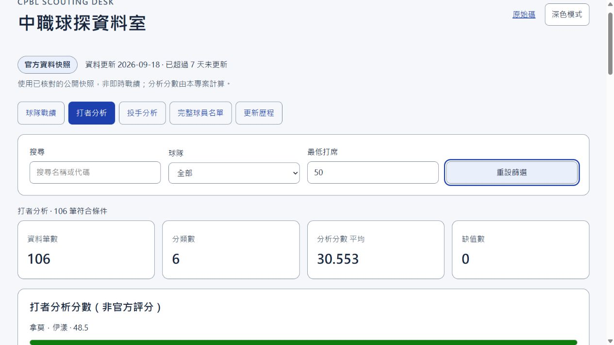
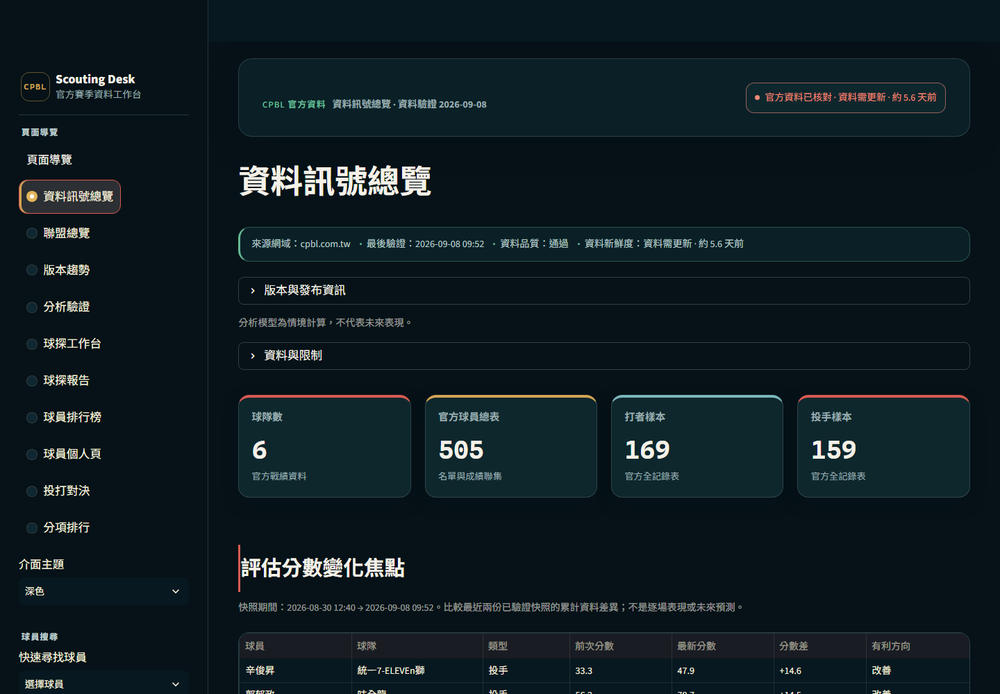
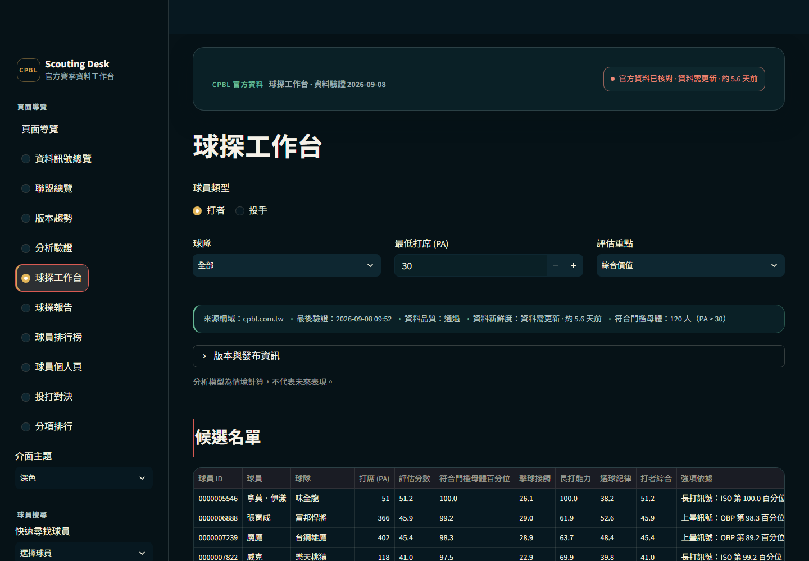
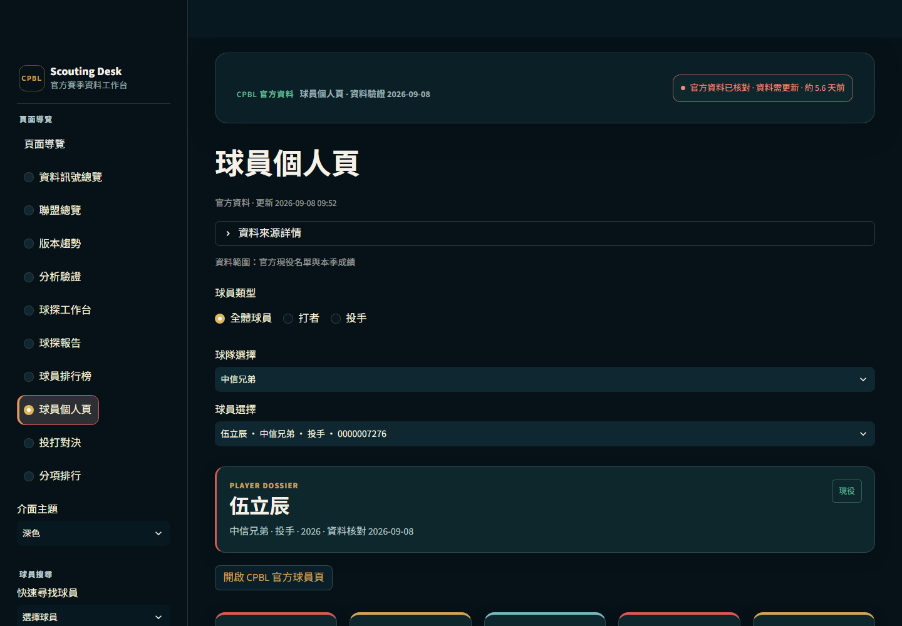

# CPBL 中職資料分析平台

[](https://github.com/Lily09-project/CPBL-baseball/actions/workflows/security.yml)
[](https://github.com/Lily09-project/CPBL-baseball/actions/workflows/data-health.yml)
[](https://github.com/Lily09-project/CPBL-baseball/actions/workflows/release-quality.yml)

以 CPBL 官方公開資料建立可追溯的資料產品，涵蓋資料品質、球員評估、球探工作台與版本差異；Streamlit 介面支援桌面、行動裝置及深淺主題。

> 非 CPBL 官方服務，不預測比賽、不產生名單建議，也不對傷勢或未來表現下結論。

## 公開展示版

[開啟互動展示網站](https://lily09-project.github.io/CPBL-baseball/) · 不需登入，也不需作者的裝置開機。

展示版使用已驗證的官方公開快照，提供搜尋、篩選、圖表、比較與 CSV／JSON 下載；會標示資料日期及過期狀態，不是即時戰績。功能邊界與發布方式見 [GitHub Pages 指南](docs/GITHUB_PAGES.md)。



## Streamlit 介面預覽





## 功能

- 以官方來源、schema、重複 ID、數值範圍、涵蓋量與資料血緣檢查把關發布。
- 球探工作台支援打者／投手門檻、球隊篩選與最多四人比較。
- 球探報告與發布 Manifest 可下載並核對版本、球員 ID 與 SHA-256。
- `player_value_score` 僅作描述性排序；LOG5 僅供情境比較，不是校準預測模型。

## Quick start

需求：Windows、Python 3.12。

```powershell
git clone https://github.com/Lily09-project/CPBL-baseball.git
cd CPBL-baseball
.\run_project.bat --check
.\run_project.bat --offline-check
python -m streamlit run app.py
```

`--check` 與 `--offline-check` 只驗證目前 checkout；需要檢查更新的官方資料時，再明確執行 `--refresh-check`。

## 驗證

```powershell
.\run_project.bat --check
.\run_project.bat --offline-check
python -m pytest -q
python -m src.verify_public_release reports/metrics/public_release_manifest.json
```

CI 另執行安全、資料健康、發布品質與瀏覽器驗收。部署與發布流程見 [部署指南](docs/DEPLOYMENT.md)、[發布檢查清單](docs/RELEASE_CHECKLIST.md)；公開資料政策見 [安全政策](SECURITY.md)。

公開儲存庫只保留程式碼、測試、驗證過的展示資料、必要文件與介面截圖；原始資料、非發布用衍生資料、個人筆記、secrets、cache 與本機暫存不提交。
