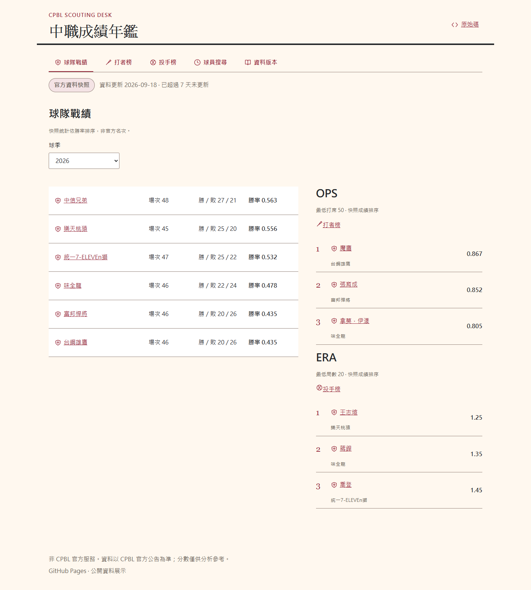
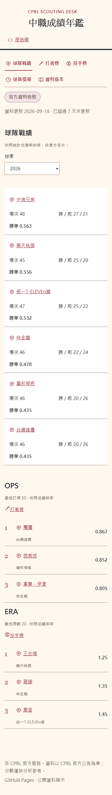

# CPBL — 中職成績年鑑與資料分析

[](https://github.com/Lily09-project/CPBL-baseball/actions/workflows/release-quality.yml)

以核對通過的 CPBL 公開快照建立可追溯的成績分析；公開展示版以球隊戰績與球員榜單為核心。

[開啟互動展示網站](https://lily09-project.github.io/CPBL-baseball/) · 不需登入，也不需作者的裝置開機。

## 展示版重點

- 閱讀球隊快照戰績、OPS 與 ERA 榜單，依球隊及最低樣本篩選。
- 查看球員完整欄位、保留官方 ID 與局數分數；支援完整球員名單。
- 最多三筆紀錄比較與 CSV／JSON 匯出；保留來源時間、更新歷程與過期提醒。

非 CPBL 官方服務，也不是即時戰績。球員成績以發布快照呈現，不推定跨球季資料；分析分數非官方評分。Python／Streamlit 的球探工作台功能另見文件。

## 介面




## 本機啟動

需求：Python 3.12；Windows 可使用專案啟動器。

```powershell
git clone https://github.com/Lily09-project/CPBL-baseball.git
cd CPBL-baseball
.\run_project.bat
```

## 測試與安全

```powershell
python -m pytest -q
```

CI 執行品質、安全與 Pages 瀏覽器驗收。公開展示只發布經允許的靜態檔案與欄位；金鑰、個人資料和本機暫存不應提交。SHA-256 用於內容完整性核對，不代表來源身分認證。

部署與功能邊界見 [GitHub Pages 指南](docs/GITHUB_PAGES.md)，安全通報見 [SECURITY.md](SECURITY.md)。

## 資料品質與評估邊界

資料管線採用官方 CPBL 資料來源（[球員](https://cpbl.com.tw/player)、[戰績](https://cpbl.com.tw/standings/season)、[成績](https://cpbl.com.tw/stats/recordallaction)），檢查資料品質與可稽核性。Python／Streamlit 球探工作台可匯出球探報告及稽核 Manifest，保留 `report_id`、`report_threshold`、`player_id` 與 SHA-256。

`player_value_score` 僅作描述性排序；LOG5 僅供情境比較，不是校準預測模型。細節見 [模型卡](docs/MODEL_CARD.md)、[部署指南](docs/DEPLOYMENT.md)、[發布清單](docs/RELEASE_CHECKLIST.md) 與 [審查指南](docs/REVIEW_GUIDE.md)。

離線與發布驗證：

```powershell
.\run_project.bat --check
.\run_project.bat --offline-check
python -m src.verify_public_release reports/metrics/public_release_manifest.json
```

## 公開儲存庫政策

可公開追蹤：程式碼、測試、經驗證的發布資料、必要文件及介面截圖。
永不追蹤：`data/raw/`、非發布用 `data/processed/`、`.env`、`.streamlit/secrets.toml`、個人資料與本機暫存。
